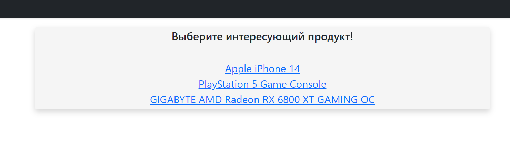
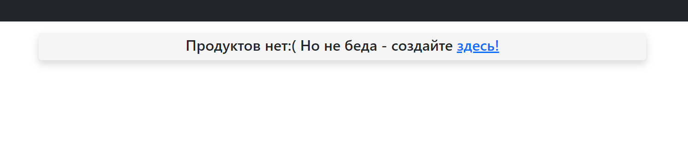
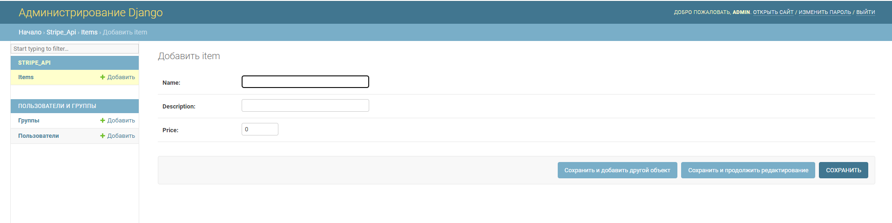

#Тестовое задание Django + Stripe API бэкенд
>Текст задания находится по [ссылке](https://github.com/MrKusaka/Django-Stripe/blob/master/Task.pdf)
###Копирование репозитория и установка зависимостей:
        git clone https://github.com/MrKusaka/djangoStripe
        cd djangoStripe
        virtualenv venv
        source venv/bin/activate
        pip install -r requirements.txt

###Устанавливаем переменные окружения:
        SECRET_KEY=<secret_key>
        DEBUG=<debug>
        STRIPE_PUBLIC_KEY=<stripe_public_key>
        STRIPE_SECRET_KEY=<stripe_secret_key>
> Ключи STRIPE_PUBLIC_KEY и STRIPE_SECRET_KEY необходимо взять по [ссылке](https://dashboard.stripe.com/test/apikeys):

###Применение миграций, создания суперпользователя и запуск проекта:
        python manage.py migrate
        python manage.py createsuperuser
        python manage.py runserver

###Импорт моей базы данных(прописывается в терминале):
        py manage.py loaddata items.json
>Я это сделал для того, чтобы можно было протестировать покупку, выглядит это так:

>Если продуктов нет, то будет следующий вид страницы:

(Это функция так же добавлена для тестирования)

> Ссылка направляет нас в Admin, для создания продукта(item):

> После создания, необходимо вернуться на главную страницу, нажав справа вверху кнопку "Открыть сайт"